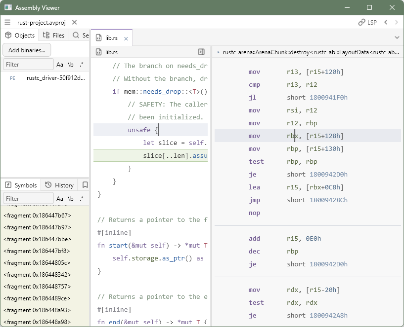

# Assembly Viewer

This program allows viewing assembly in binaries. It focuses on comparison with source code to inspect compiler results. It relies on declared symbols and debug info instead of doing its own analysis.

Relocation support is incomplete.

## Features

- Architectures: x86-64
- PE, ELF, COFF files and static archives
- DWARF and PDB debug info
- Fully linked binaries
- rust-analyzer support for source navigation
- Rust scratchpad to easily compile sample code
